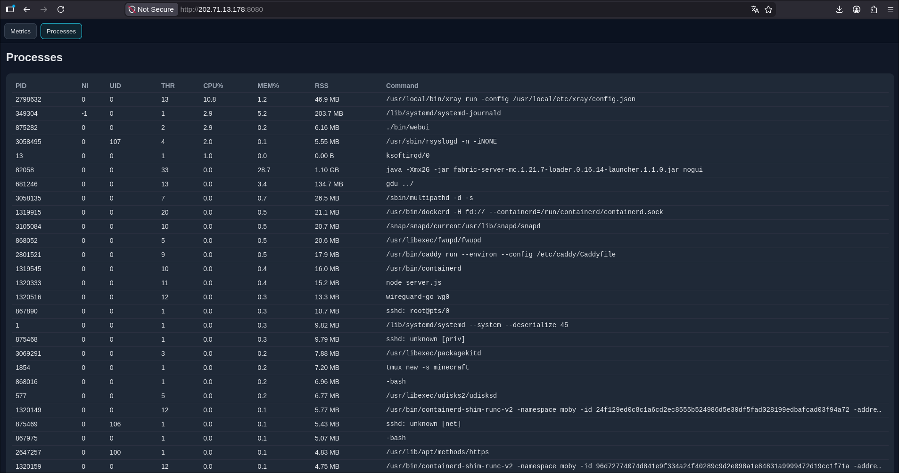
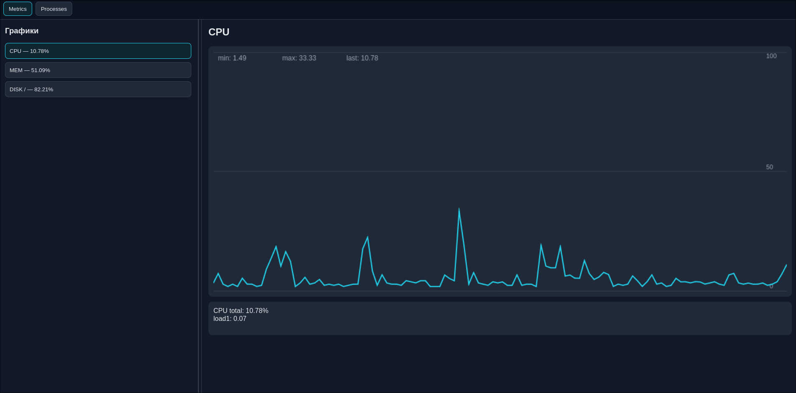

# WTOP (kvadraOS команда 2)

вебграфический top с поддержкой графиков

# Быстрый тест без компиляции


# Изображения



вывод сразу всей доступной информации даже при перезаходе в браузер (за ограниченный промежуток пока)

# dependences
## динамические для самого сервера
    boost > 1.74
    GCC > 4.10
    GLibcxx > 3.429
    Glibc > 2.9
## для компиляции ts
    typescript > 4.9.5

# build

```
git clone https://github.com/bYPABchuK/cooltests/
cd kvadraOS_2
// npm install typescript (если ещё нет)
make webui
```

